# ASCOM-Compatible Wireless Flat Panel

I do not charge anything to create and maintain these open-source projects. But if you would like to say "thanks" for this project, feel free to send any amount through Paypal using the button below. I appreciate your support!

* [Introduction](#introduction)
* [Finished Product](#finished-product)
* [User Manual](#user-manual)
* [Pre-Requisites](#pre-requisites)
* [Hardware](#hardware)
* [Bill Of Material](#bill-of-material)
* [ASCOM Driver](#ascom-driver)
  + [Downloading And Installing The Driver](#downloading-and-installing-the-driver)
  + [Compiling The Driver (For Developers Only)](#compiling-the-driver-for-developers-only)
* [Arduino Firmware](#arduino-firmware)
  + [Microcontroller Compatibility](#microcontroller-compatibility)
  + [Compiling And Uploading The Firmware](#compiling-and-uploading-the-firmware)
* [Electronic Circuit](#electronic-circuit)
  + [Schematics](#schematics)
  + [Breadboard Prototyping](#breadboard-prototyping)
  + [PCB](#pcb)
* [Mechanical Components And Assembly](#mechanical-components-and-assembly)
* [Frequently Asked Questions (FAQ)](#frequently-asked-questions-faq)

## Introduction

This project is the second iteration of my original DIY [ASCOM-compatible flat panel](https://github.com/jlecomte/ascom-flat-panel). It brings a major usability improvement over the first version: It is completely wireless! (whereas the first version relied on a USB type C and a 12V DC cable...) which makes it even easier to use, especially in the dark! It has several other enhancements compared to the original version, and I invite you to check out this video to find out more:

[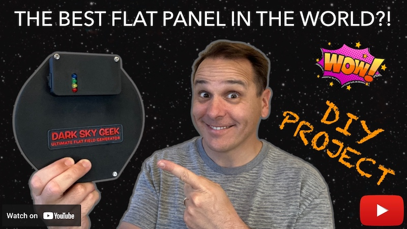](https://www.youtube.com/watch?v=POvcBwyBBEU)

## Finished Product

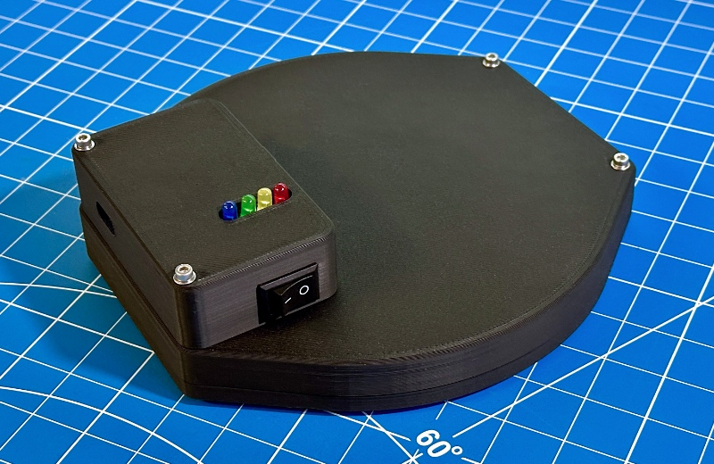

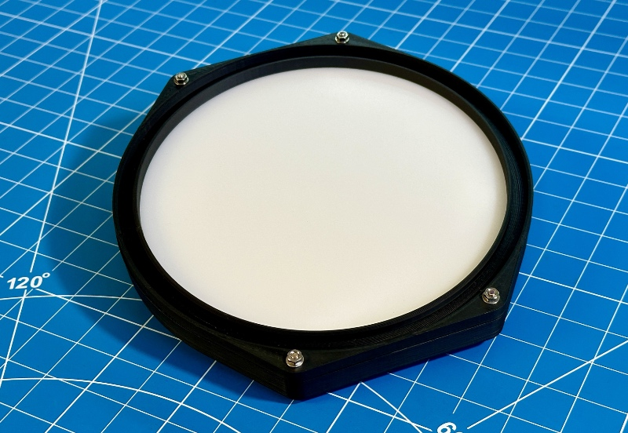

## User Manual

Upon turning on the device, the indicator LEDs will show the battery voltage status. After 5 seconds, only the red LED will remain in use, indicating whether a device is currently connected: it will be solid on if a device is connected, or it will continuously blink otherwise.

Before you can connect to the wireless flat panel for the first time, you must select the appropriate device and open the device settings dialog. Here is what that looks like in N.I.N.A.:

In the device settings dialog, you must then select the appropriate Bluetooth device. The driver will remember your selection, so this is a one-time operation. This step is necessary to ensure that, in the field, where there may be several such wireless flat panels nearby, you are connecting and controlling the right device. Here is what the driver settings dialog looks like the first time you open it. It listens for Bluetooth advertisement packets coming from wireless flat panel devices only.

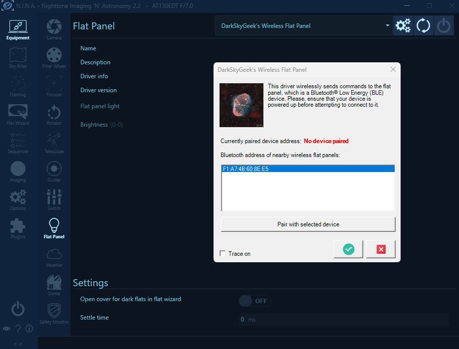

Of course, the Bluetooth address will be meaningless to you, but that is not important. Click on a Bluetooth address, and click on the "Pair with selected device" button:

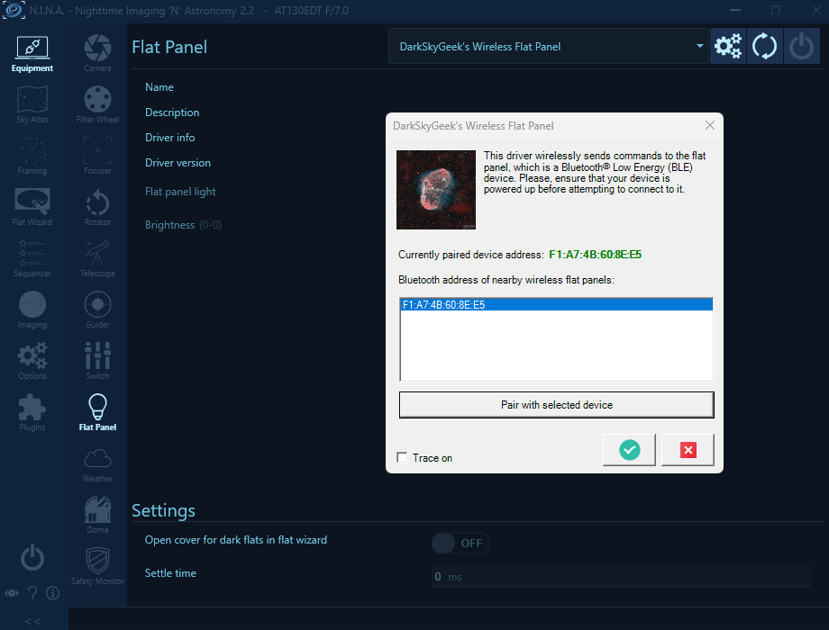

**Note:** This is not really Bluetooth pairing. It is merely device selection. But most users are familiar with the "Bluetooth pairing" terminology, so I used it, even if it is not perfectly accurate from a technical point of view.

Don't forget to validate your choice by clicking on the green checkmark button at the bottom of the device settings dialog! (otherwise, your selection will not be taken into account)

If you do this at home with only one wireless flat panel turned on, you should see only one Bluetooth address in the list, so that's easy. However, if you do this in the field, and there is another wireless flat panel nearby, you may see several Bluetooth addresses. Choose one, connect to it, and turn it on/off to identify which device you are connected to. If you happen to select the wrong device, disconnect from it, open the driver settings dialog again, and choose another Bluetooth address (you will have remembered the Bluetooth address you connected to on the first try...) Simple! Of course, it's easier to do this at home when there is only one device showing in the list... Once the right device has been selected, you can finally connect to it:

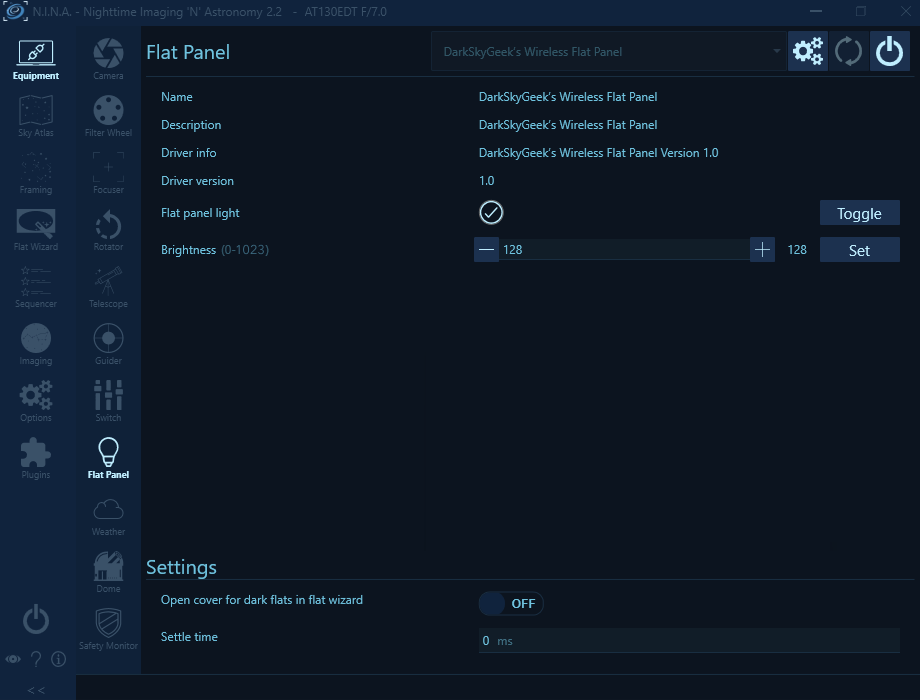

## Pre-Requisites

* A Windows computer (Windows 10 or newer)
* [Microsoft Visual Studio](https://visualstudio.microsoft.com/)
* [ASCOM Platform](https://ascom-standards.org/)
* [ASCOM Platform Developer Components](https://ascom-standards.org/COMDeveloper/Index.htm)
* [Arduino IDE](https://www.arduino.cc/en/software)
* [FreeCAD](https://www.freecadweb.org/), a free and open-source 3D parametric modeler. Make sure that you have the latest version installed!
* A 3D printer and a slicer (I use a Creality Ender 3 S1 Plus, and Ultimaker Cura)
* A few basic tools that any tinkerer must own, such as a breadboard, a soldering iron, etc.

## Hardware

* [Adafruit Feather nRF52840 Express](https://www.adafruit.com/product/4062)
* [Natural white 5V LED strip](https://www.amazon.com/dp/B08H51D8QV)
* [FQP30N06L](https://www.amazon.com/dp/B07WHSD3GJ) (logic-level MOSFET)
* An assortment of 1/4W resistors ([example](https://www.amazon.com/dp/B08FD1XVL6))
* An assortment of colored 5mm LEDs ([example](https://www.amazon.com/dp/B09XDMJ6KY))
* A small LiPo battery with a JST-PH 2mm connector ([example](https://www.amazon.com/gp/product/B07BTV3W87)) — The polarity of the connector may be incorrect, so be careful or you may fry the expensive Adafruit Feather board! See note below...
* [Taloya LED Flush Mount Ceiling Light](https://www.amazon.com/dp/B08GX81JB1) — We will take it apart to extract its background disk, Light Guiding Plate (LGP), and diffuser. If you are outside the US and cannot find this item, look for an LED ceiling light on AliExpress ([Here](https://www.aliexpress.us/item/3256804883844716.html) is one that *may* work, I have not verified it) If you go with a different option than the one I selected, you will likely have to make changes to the project, for which I will not be able to support you.
* [3mm thick white acrylic sheet](https://www.amazon.com/dp/B083XQ2QS7) — We will use that to make the internal diffuser.
* [Rocker switch ON/OFF](https://www.amazon.com/dp/B07XD8J2PL)
* [Brass inserts for 3D printed parts](https://www.amazon.com/dp/B0BXD1YMNS)
* [Assortment of small metric screws, nuts, and washers](https://www.amazon.com/dp/B08JCKH31Q)
* [Assortment of JST-XH connectors](https://www.amazon.com/dp/B01MCZE2HM)
* [Assortment of electrolytic capacitors](https://www.amazon.com/dp/B07PBQXQNQ)

The following items are technically optional, but highly recommended:

* [Bench Power Supply](https://www.amazon.com/dp/B07GCJ5QHF)
* [Solderless Breadboard](https://www.amazon.com/gp/product/B07LG9V8WQ)
* [Solderless LED strip connectors](https://www.amazon.com/dp/B0BLCQXSXH) — Useful for testing, but cannot be used in the finished product without making changes to the 3D model.

**Important note about the LED strip:** Pick a "natural white" LED strip. Stay away from "warm white" because you will run into some problems with your OIII filter (it does not emit enough in the blue part of the spectrum) or "cool white" because you will have similar issues, but with the H⍺ or SII filters (it does not emit enough in the red part of the spectrum). Also, stay away from so-called "high density" LED strips, they are simply too bright for our application. And finally, note that most LED strips require 12V DC, but in this project, we need one that can be powered with 5V DC. Actually, we are going to power the LED strip using 3.3V DC so that it is not too bright for our application.

**Important note about the LiPo battery:** Do _not_ connect the LiPo battery directly to the microcontroller board via the JST connector, unless you are certain about the battery's connector polarity. See the warning documented on [this Adafruit documentation page](https://learn.adafruit.com/introducing-the-adafruit-nrf52840-feather/power-management-2).

## Bill Of Material

Assuming that you already own a 3D printer, some basic equipment (e.g., a soldering iron), and some basic hardware and electronic components (an assortment of resistors and colored LEDs can be purchased in bulk and reused for a variety of projects — same for metric nuts and bolts or threaded inserts), here is the bill of materials (BOM) for this project (all prices are in USD and accurate as of January 2024):

* Adafruit Feather nRF52840 Express: **$25**
* LED strip: **$11**
* MOSFET: $10 for a pack of 10, so we will only count **$1** for this item in the BOM cost.
* LiPo battery: **$12**
* Taloya ceiling light: **$14**
* Switch: $9 for a pack of 10, so we will only count **$1** for this item in the BOM cost.
* White acrylic sheet: $24 for 3 12"x12" sheets, so we will only count **$8** for this item in the BOM cost.
* PCB manufacturing + shipping: $15 for 5 PCBs, so we will only count **$3** for this item in the BOM cost.
* Miscellaneous: JST connectors, capacitor, resistors, etc. These are so cheap that they do not contribute much to the BOM cost.

**Total cost ~ $75**

While this isn't exactly "cheap", it is significantly more affordable than a commercial unit. For example, PrimaLuceLab sells an excellent, albeit wired flat field generator named Giotto which, for a 6" refractor, costs **$315**. [Deep Sky Dad](https://deepskydad.com/) sells excellent _motorized_ flat panels, but they cost **$300** and up. This should help you decide whether this project is worth the effort.

## ASCOM Driver

### Downloading And Installing The Driver

You can install the ASCOM driver by simply running the executable setup file that you will find in the [releases page](https://github.com/jlecomte/ascom-wireless-flat-panel/releases). By default, it places files under `C:\Program Files (x86)\Dark Sky Geek\Wireless Flat Panel ASCOM Driver`.

### Compiling The Driver (For Developers Only)

Open Microsoft Visual Studio as an administrator (right click on the Microsoft Visual Studio shortcut, and select "Run as administrator"). This is required because when building the code, by default, Microsoft Visual Studio will register the compiled COM components, and this operation requires special privileges (Note: This is something you can disable in the project settings...) Then, open the solution (`ASCOM_Driver\WirelessFlatPanel.sln`), change the solution configuration to `Release` (in the toolbar), open the `Build` menu, and click on `Build Solution`. As long as you have properly installed all the required dependencies, the build should succeed and the ASCOM driver will be registered on your system. The binary file generated will be `ASCOM_Driver\bin\Release\ASCOM.DarkSkyGeek.WirelessFlatPanel.dll`. You may also download this file from the [Releases page](https://github.com/jlecomte/ascom-wireless-flat-panel/releases).

## Arduino Firmware

### Microcontroller Compatibility

The firmware was written specifically for, and tested with, an Adafruit Feather nRF52840 Express. It will likely not work on all Arduino-compatible boards. Please, do not file an issue if you encounter a problem with a different type of microcontroller board.

### Compiling And Uploading The Firmware

* Please, follow the [Arduino IDE setup steps](https://learn.adafruit.com/introducing-the-adafruit-nrf52840-feather/arduino-bsp-setup) published by Adafruit.
* Then, connect your Adafruit Feather nRF52840 Express board to your computer using a micro USB cable, open the sketch file located at `Arduino_Firmware\Arduino_Firmware.ino`, and click on the `Upload` button in the toolbar.

## Electronic Circuit

I included a [KiCad](https://www.kicad.org/) project in the `KiCad_Project/` directory.

### Schematics

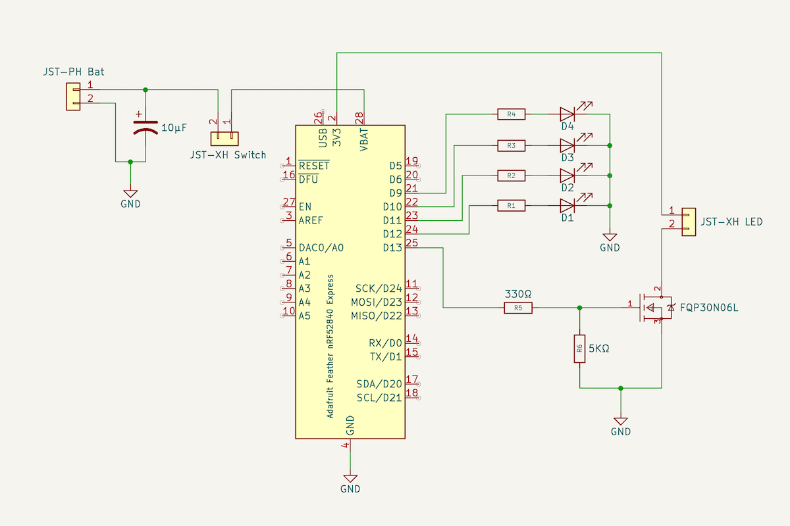

The values of the resistors R1-R4 depend on the specific colored LEDs you are using. In my case, in order to have all the colored LEDs emit roughly the same brightness, I settled on the following values. You will have to experiment a bit to find out which values work best for you.

* `R1`: 2kΩ
* `R2`: 5kΩ
* `R3`: 1kΩ
* `R4`: 2kΩ

### Breadboard Prototyping

It is critical to prototype this circuit on a breadboard before ordering a PCB, or soldering the components on a perforated board. Here is what my prototype looked like:

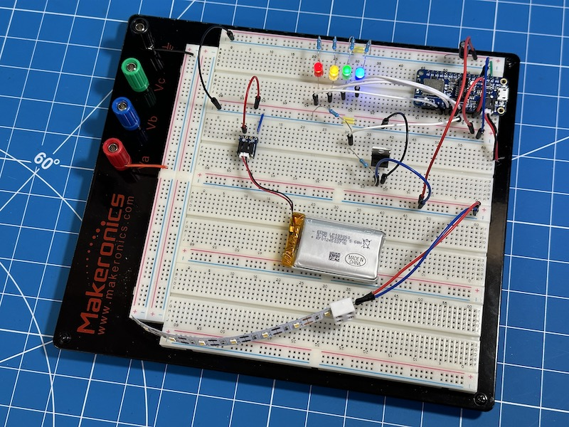

### PCB

Here are 3D renderings of the PCB:

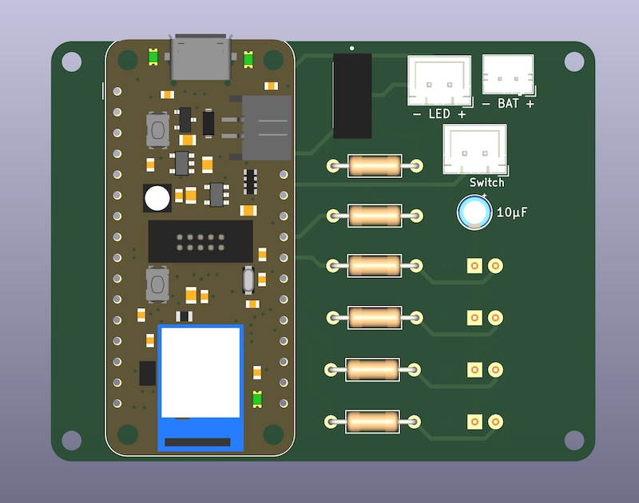

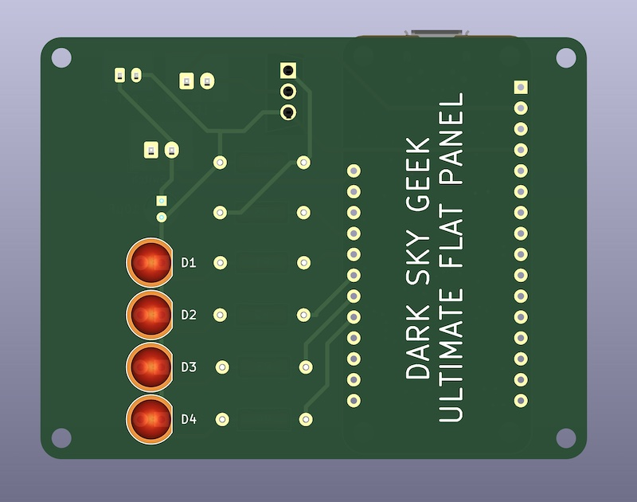

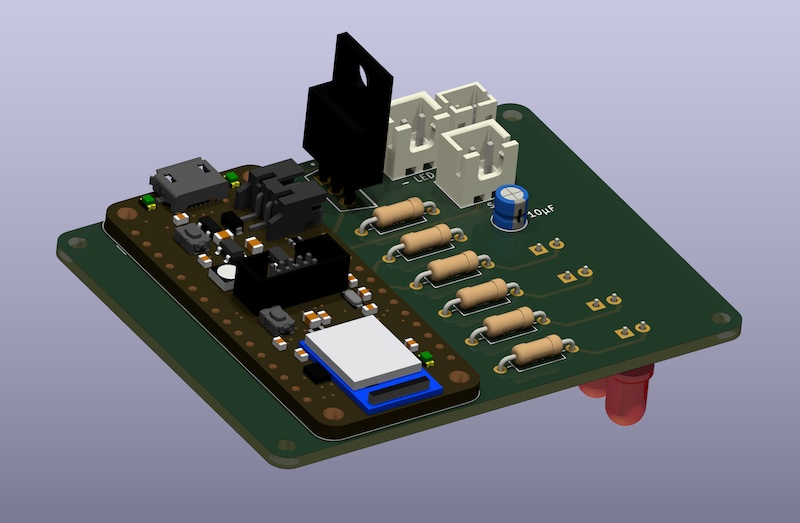

And here is a rendering of the various PCB layers:

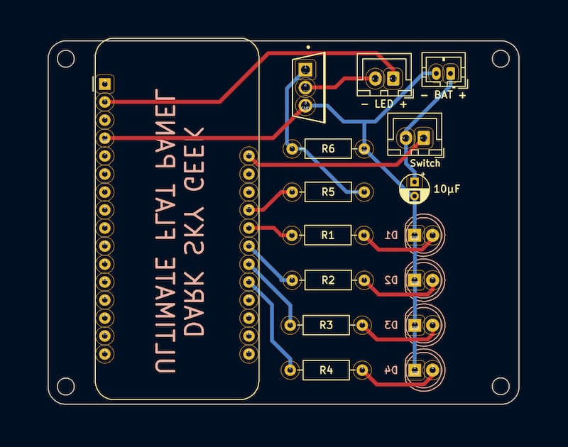

I exported the Gerber files so that you can have the board manufactured by PCBWay (download the Gerber files for PCBWay [here](KiCad_Project/PCBWay.zip)). When you create your order with PCBWay, keep all the defaults, and set the board size to 66.5mm x 51.3mm. To keep the cost down, select the cheapest shipping method (to ship to the US, I select USPS) and consider doing a "group buy" with other people.

If you want to work with another PCB manufacturer, you will need to open the KiCad project and export the PCB layout to Gerber files. Please, follow the instructions of your PCB manufacturer. They all have slightly different requirements...

Here is a photograph of the control box, which hosts the PCB, after soldering all the components. Note how the switch has been wired.

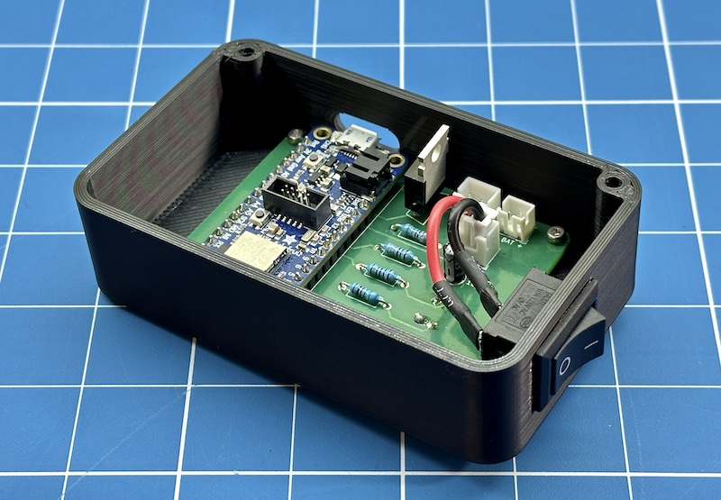

The battery indicator LEDs protrude slightly on the other side of the control box:

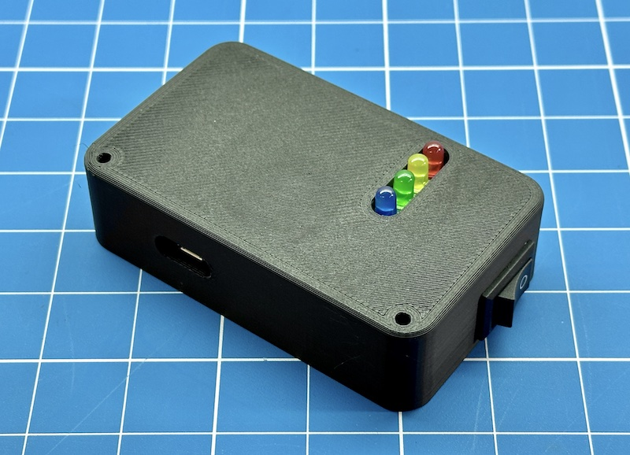

## Mechanical Components And Assembly

If you are new to 3D modeling and 3D printing, take a look at [this video](https://www.youtube.com/watch?v=02CWCsGPJ-s) for a quick introduction.

You will need to print a number of parts. Use the 3D model I included in this repository ([`3D_Files/FreeCAD_Model.FCStd`](3D_Files/FreeCAD_Model.FCStd)) to generate STL files for your telescope. Simply open the 3D model in the most recent version of FreeCAD, click on the `Parameters` spreadsheet, and modify the OTA diameter and thickness values. The parametric model will automatically adapt to those values, and you will be able to export your own STL files, which you can then import into your slicer of choice.

In order to achieve good uniformity, this panel has two diffusers. The 3mm thick internal diffuser is made from a white acrylic sheet, and is located right underneath the spacer / right above the LGP. The external diffuser was extracted from the Tayola ceiling light.

To cut the LGP and the two diffusers cleanly and properly, I strongly recommend using a router table. The FreeCAD model contains 3 router templates, which you will need to print. Simply rough cut the component using a scroll saw (for example) and clean it up at the router table, using the appropriate template and a flush cut bit:

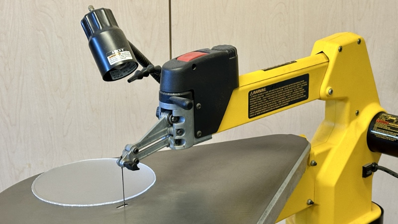

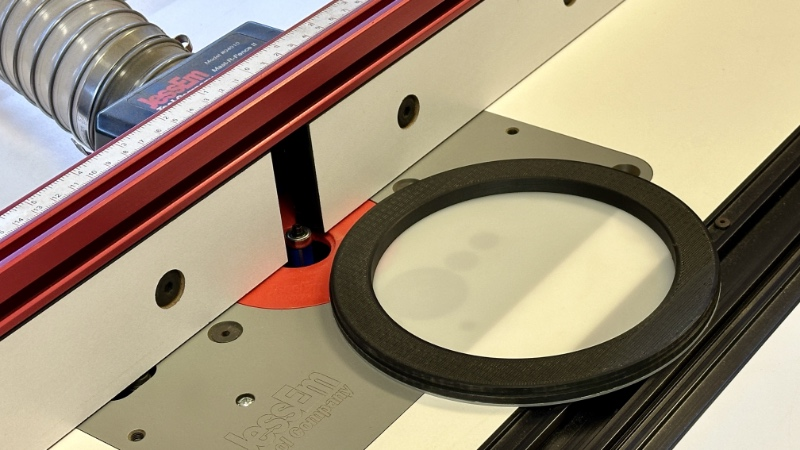

Please refer to this diagram to help you understand where the various components should be placed:

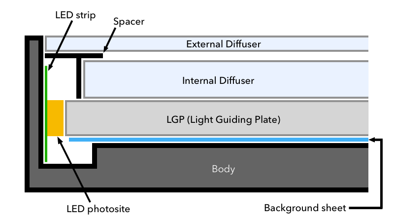

Solder flexible wires to the LED strip, and hot glue the connection (I used 5 minute epoxy) to ensure that they never work themselves loose... Then, install the LED strip into the body of the flat panel:

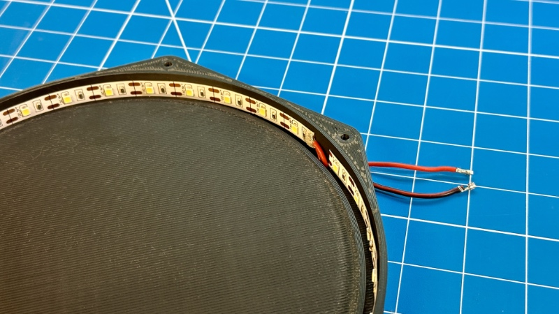

Install the background sheet and the LGP. It should be difficult to fit the LGP! The diodes on the LED strip must contact the side of the LGP, so it is normal and expected that it is a tight fit. I had to use a tiny screwdriver to ever so slightly pry the LED strip so I could push the LGP down all the way. Take your time, this is one of the most difficult operations!

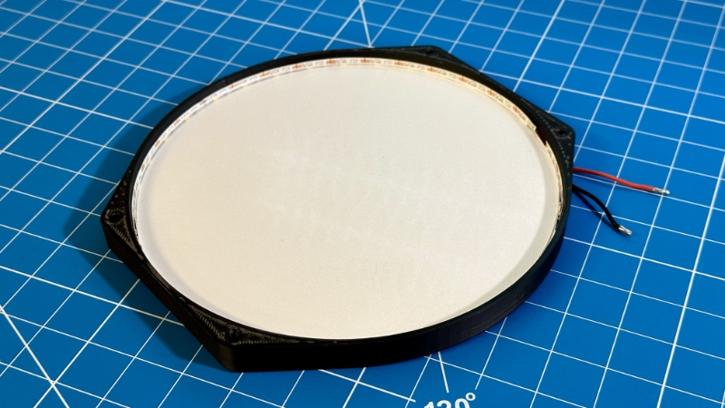

Prepare the **internal diffuser**, which is made of a 3mm thick white acrylic sheet, and the spacer, and place them on top of the LGP:

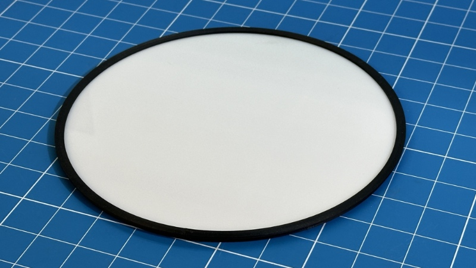

Prepare the **external diffuser**, which you extracted from the Tayola ceiling light, and place it on top of the spacer:

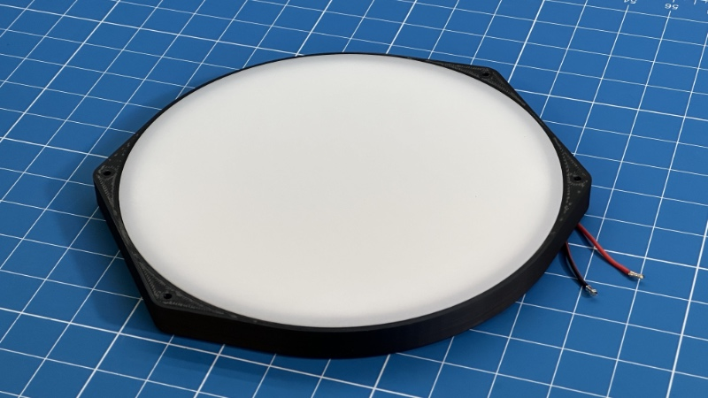

Place the front on top of the external diffuser:

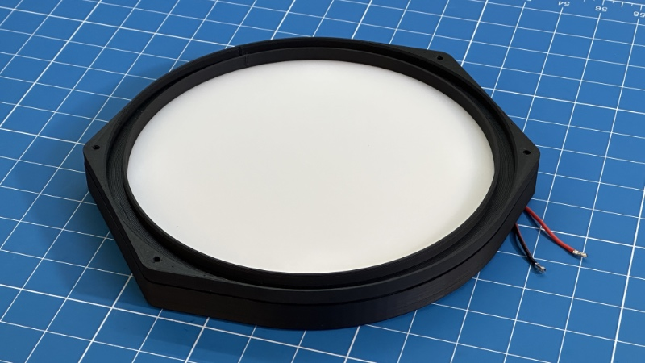

Install a JST connector for the LED leads, and connect the LED strip inside the control box:

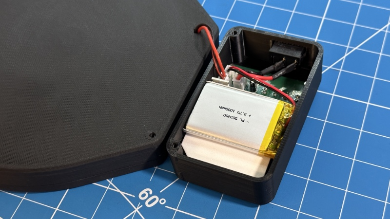

**Note:** I used some foam padding to ensure that the battery was not going to move around.

All you have left to do is to fasten the flat panel using M3 bolts, washers, and nuts.

## Frequently Asked Questions (FAQ)

**Question:** Can you make this for me? I'll pay for it!

**Answer:** I really wish I could. Unfortunately, I do not have the time necessary to manufacture this product for a large number of people.

**Question:** OK, I decided to build it, but I am stuck. Can you help me?

**Answer:** I will do my best, but I cannot provide any guarantee. Please, [file an issue](https://github.com/jlecomte/ascom-wireless-flat-panel/issues).

**Question:** Can you incorporate your DIY [ASCOM-compatible telescope cover](https://github.com/jlecomte/ascom-telescope-cover) into this project?

**Answer:** I am not interested in consolidating this project with my DIY [ASCOM-compatible telescope cover](https://github.com/jlecomte/ascom-telescope-cover) because, in my case, it would add too much weight to the front of my already front-heavy OTA, making it more difficult to balance, and causing all kinds of issues with the camera possibly hitting the tripod legs since the OTA would have to be moved back to provide proper balance. If you have a fully remote setup, I recommend looking at the excellent motorized flat panels sold by [Deep Sky Dad](https://deepskydad.com/). Otherwise, you can use a large and affordable LED tracing panel, which you can easily find on Amazon. Modify it to be ASCOM-compatible (see [this CloudyNights article](https://www.cloudynights.com/topic/536533-diy-alnitak-flat-panel/)), and position it vertically. Then, simply slew the telescope to it (the telescope will be in a horizontal position). Most modern Go-To mounts support storing several custom positions, so that makes it even easier! Anyway, you have a few options...

**Question:** Is this panel uniform enough?

**Answer:** Absolutely! Please refer to [my evaluation of the uniformity of this panel](https://github.com/jlecomte/circular-led-flat-panel-evaluation) for more information.

**Question:** Is this compatible with ZWO's ASIAir?

**Answer:** Unfortunately, no. As far as I know, ASIAir does not support ASCOM-compatible flat panels of any kind. That is because ASIAir is a closed ecosystem, and it is not possible to install additional drivers on an ASIAir unit. Additionally, ASIAir is based on the INDI platform, and I have not released an INDI driver for this device.

**Question:** My antivirus identifies your setup executable file as a malware (some kind of Trojan)

**Answer:** This is a false detection, extremely common with installers created with [Inno Setup](https://jrsoftware.org/isinfo.php) because virus and malware authors also use Inno Setup to distribute their malicious payload... Anyway, there isn't much I can do about this, short of signing the executable. Unfortunately, that would require a code signing certificate, which costs money. So, even though the executable I uploaded to GitHub is perfectly safe, use at your own risk!
