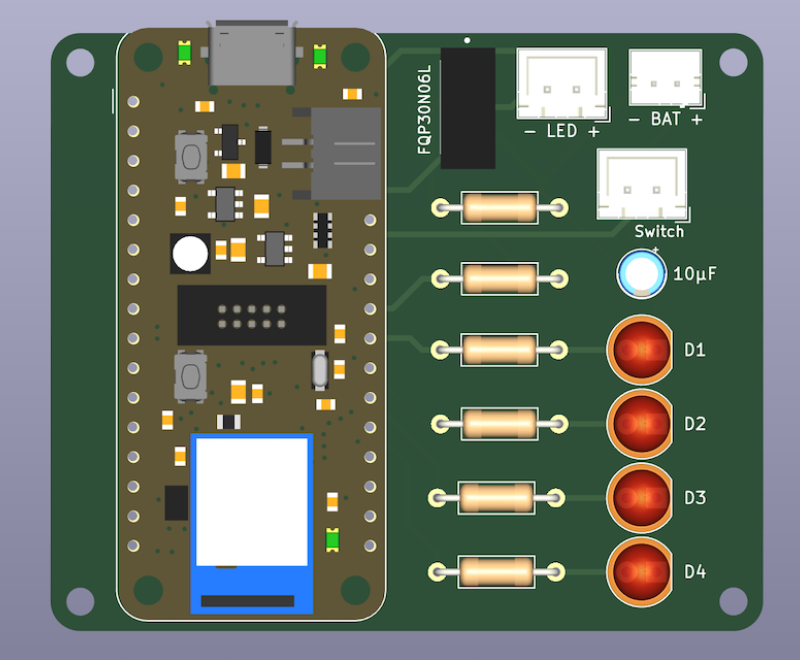
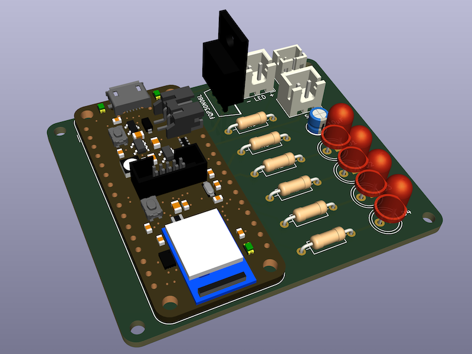

# ASCOM-Compatible Wireless Flat Panel

* [Introduction](#introduction)
* [Finished Product](#finished-product)
* [Screenshots](#screenshots)
* [Pre-Requisites](#pre-requisites)
* [Hardware](#hardware)
* [ASCOM Driver](#ascom-driver)
  + [Downloading And Installing The Driver](#downloading-and-installing-the-driver)
  + [Compiling The Driver (For Developers Only)](#compiling-the-driver-for-developers-only)
* [Arduino Firmware](#arduino-firmware)
  + [Microcontroller Compatibility](#microcontroller-compatibility)
  + [Compiling And Uploading The Firmware](#compiling-and-uploading-the-firmware)
* [Mechanical Components](#mechanical-components)
* [Electronic Circuit](#electronic-circuit)
  + [Schematics](#schematics)
  + [Breadboard Prototyping](#breadboard-prototyping)
  + [PCB](#pcb)

## Introduction

This project is the second iteration of my original DIY [ASCOM-compatible flat panel](https://github.com/jlecomte/ascom-flat-panel). It brings a major usability improvement over the first version: It is completely wireless! (whereas the first version relied on a USB type C and a 12V DC cable...) which makes it even easier to use, especially in the dark and at a remote dark site.

**Note:** I am not interested in consolidating this project with my DIY [ASCOM-compatible telescope cover](https://github.com/jlecomte/ascom-telescope-cover) because, in my case, it would add too much weight to the front of my already front-heavy OTA, making it more difficult to balance, and causing all kinds of issues with the camera possibly hitting the tripod legs since the OTA would have to be moved back to provide proper balance. If you have a fully remote setup, and balance is an issue (it often is with long triplet refractors...), I recommend using a large and affordable LED tracing panel, which you can easily find on Amazon. Modify it to be ASCOM-compatible (see [this CloudyNights article](https://www.cloudynights.com/topic/536533-diy-alnitak-flat-panel/)), and position it vertically. Then, simply slew the telescope to it (the telescope will be in a horizontal position). Most modern Go-To mounts support storing several custom positions, so that makes it even easier! The only way to integrate a flat panel with an automated telescope cover would be to use an electroluminescent panel, which is a lot lighter and thinner. But you will likely not find one that is exactly the size of your OTA (unless you are lucky). Anyway, you have options...

## Finished Product

TBD

## Screenshots

TBD

## Pre-Requisites

* A Windows computer (Windows 10 or newer)
* [Microsoft Visual Studio](https://visualstudio.microsoft.com/) (FYI, I used the 2022 edition...)
* [ASCOM Platform](https://ascom-standards.org/)
* [ASCOM Platform Developer Components](https://ascom-standards.org/COMDeveloper/Index.htm)
* [Arduino IDE](https://www.arduino.cc/en/software)
* [FreeCAD](https://www.freecadweb.org/), a free and open-source 3D parametric modeler
* A 3D printer and a slicer (I use a Creality Ender 3 v2, and Ultimaker Cura)
* A few basic tools that any tinkerer must own, such as a breadboard, a soldering iron, etc.

## Hardware

* [Adafruit Feather nRF52840 Express](https://www.adafruit.com/product/4062)
* [Natural white 5V LED strip](https://www.amazon.com/dp/B08H51D8QV)
* [Solderless LED strip connectors](https://www.amazon.com/dp/B0BLCQXSXH)
* [FQP30N06L](https://www.amazon.com/dp/B07WHSD3GJ) (logic-level MOSFET)
* [Resistors](https://www.amazon.com/dp/B08FD1XVL6)
* [LEDs](https://www.amazon.com/dp/B09XDMJ6KY)
* [Small LiPo battery](https://www.amazon.com/dp/B09DPNCLQZ)
* [Bench Power Supply](https://www.amazon.com/dp/B07GCJ5QHF)
* [Taloya LED Flush Mount Ceiling Light](https://www.amazon.com/dp/B08GX81JB1) (to extract the background disk and the Light Guiding Plate, aka LGP)
* [White Acrylic Sheet](https://www.amazon.com/dp/B083XQ2QS7) (to make the diffuser)
* [Brass inserts for 3D printed parts](https://www.amazon.com/dp/B0BXD1YMNS)
* [Assortment of small metric screws, nuts, and washers](https://www.amazon.com/dp/B08JCKH31Q)
* [22AWG solid core electrical wires](https://www.amazon.com/dp/B088KQFHV7)

**Important note about the LED strip:** Pick a "natural white" LED strip. Stay away from "warm white" because you will run into some problems with your OIII filter (it does not emit enough in the blue part of the spectrum) or "cool white" because you will have similar issues, but with the H⍺ or SII filters (it does not emit enough in the red part of the spectrum). Also, stay away from so-called "high density" LED strips, they are simply too bright for our application. And finally, note that most LED strips require 12V DC, but in this project, we need one that can be powered with 5V DC. Actually, we are going to power the LED strip using 3.3V DC so that it is not too bright for our application.

**Important note about the LiPo battery:** Do _not_ connect the LiPo battery directly to the microcontroller board via the JST connector, unless you are certain about the battery's connector polarity. See the warning documented on [this Adafruit documentation page](https://learn.adafruit.com/introducing-the-adafruit-nrf52840-feather/power-management-2).

## ASCOM Driver

### Downloading And Installing The Driver

**Step 1:** Download the driver from the [releases page](https://github.com/jlecomte/ascom-wireless-flat-panel/releases), and place the file `ASCOM.DarkSkyGeek.WirelessFlatPanel.dll` somewhere on your system (example: `C:\Users\julien\ascom-wireless-flat-panel\`).

**Step 2:** Open a command prompt, but make sure you run it **as an administrator**!

**Step 3:** Then, proceed with the installation of the driver using `RegAsm.exe`, a utility that should already be present on your system (it comes with the .NET framework). Just don't forget to use the 64 bit version, and to pass the `/tlb /codebase` flags. Here is what it looked like on my imaging mini computer:

```
> cd C:\Users\julien\ascom-flat-panel\
> C:\Windows\Microsoft.NET\Framework64\v4.0.30319\RegAsm.exe /tlb /codebase ASCOM.DarkSkyGeek.WirelessFlatPanel.dll
Microsoft .NET Framework Assembly Registration Utility version 4.8.4161.0
for Microsoft .NET Framework version 4.8.4161.0
Copyright (C) Microsoft Corporation.  All rights reserved.

Types registered successfully
```

**Note:** The output may be more verbose than the above. As long as it says `Types registered successfully`, you are good to go!

**Note:** During registration, you will see a warning that the assembly is unsigned. This is normal as I did not bother going through the pain of signing the assembly, so you will just have to trust that you are registering the DLL that I built and uploaded to GitHub. And if you don't trust me / GitHub, you can build the DLL yourself using Visual Studio.

**Note:** Once the driver has been installed, make sure you do _not_ delete or move the `ASCOM.DarkSkyGeek.WirelessFlatPanel.dll` file, or things will not work! (if you do move it, you will need to register it again in its new location)

**Step 4:** Start (or restart, if it was already running) N.I.N.A. (or whatever application you use to control your equipment).

### Compiling The Driver (For Developers Only)

Open Microsoft Visual Studio as an administrator (right click on the Microsoft Visual Studio shortcut, and select "Run as administrator"). This is required because when building the code, by default, Microsoft Visual Studio will register the compiled COM components, and this operation requires special privileges (Note: This is something you can disable in the project settings...) Then, open the solution (`ASCOM_Driver\ASCOM.DarkSkyGeek.WirelessFlatPanel.sln`), change the solution configuration to `Release` (in the toolbar), open the `Build` menu, and click on `Build Solution`. As long as you have properly installed all the required dependencies, the build should succeed and the ASCOM driver will be registered on your system. The binary file generated will be `ASCOM_Driver\bin\Release\ASCOM.DarkSkyGeek.WirelessFlatPanel.dll`. You may also download this file from the [Releases page](https://github.com/jlecomte/ascom-wireless-flat-panel/releases).

## Arduino Firmware

### Microcontroller Compatibility

The firmware was written specifically for, and tested with, an Adafruit Feather nRF52840 Express. It will likely not work on all Arduino-compatible boards. Please, do not file an issue if you encounter a problem with a different type of microcontroller board.

### Compiling And Uploading The Firmware

* Please, follow the [Arduino IDE setup steps](https://learn.adafruit.com/introducing-the-adafruit-nrf52840-feather/arduino-bsp-setup) published by Adafruit.
* Then, connect your Adafruit Feather nRF52840 Express board to your computer using a micro USB cable, open the sketch file located at `Arduino_Firmware\Arduino_Firmware.ino`, and click on the `Upload` button in the toolbar.

## Mechanical Components

The STL files you will find in the `3D_Files/STL/` folder are just a starting point. You will likely have to create your own version of this project, if only to match the size of the panel to your own OTA... That is why I included the FreeCAD model in this repository (`3D_Files/Freecad_Model.FCStd`). Since there are no moving parts, it is a relatively simple assembly.

## Electronic Circuit

I included a [KiCad](https://www.kicad.org/) project in the `KiCad_Project/` directory.

### Schematics


### Breadboard Prototyping

It is critical to prototype this circuit on a breadboard before ordering a PCB, or soldering the components on a perforated board. Here is what my prototype looked like:


### PCB

Here are 3D renderings of the PCB:






Using KiCad, you can export the PCB layout to Gerber files. Please, follow the instructions of your PCB manufacturer (I used PCBWay)

## Assembling The Flat Panel

TBD
