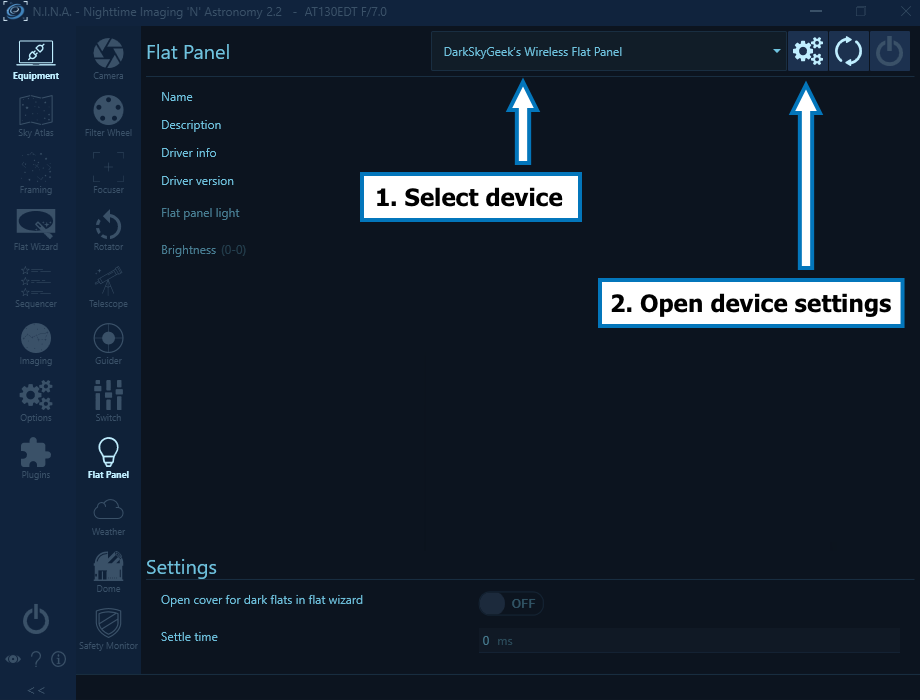

# ASCOM-Compatible Wireless Flat Panel

* [Introduction](#introduction)
* [Finished Product](#finished-product)
* [Introduction Video](#introduction-video)
* [Pre-Requisites](#pre-requisites)
* [Hardware](#hardware)
* [ASCOM Driver](#ascom-driver)
  + [Downloading And Installing The Driver](#downloading-and-installing-the-driver)
  + [Compiling The Driver (For Developers Only)](#compiling-the-driver-for-developers-only)
  + [Screenshots And User Manual](#screenshots-and-user-manual)
* [Arduino Firmware](#arduino-firmware)
  + [Microcontroller Compatibility](#microcontroller-compatibility)
  + [Compiling And Uploading The Firmware](#compiling-and-uploading-the-firmware)
* [Mechanical Components](#mechanical-components)
* [Electronic Circuit](#electronic-circuit)
  + [Schematics](#schematics)
  + [Breadboard Prototyping](#breadboard-prototyping)
  + [PCB](#pcb)
* [Assembling The Flat Panel](#assembling-the-flat-panel)
* [Using The Flat Panel With NINA](#using-the-flat-panel-with-nina)

## Introduction

This project is the second iteration of my original DIY [ASCOM-compatible flat panel](https://github.com/jlecomte/ascom-flat-panel). It brings a major usability improvement over the first version: It is completely wireless! (whereas the first version relied on a USB type C and a 12V DC cable...) which makes it even easier to use, especially in the dark!

**Note:** I am not interested in consolidating this project with my DIY [ASCOM-compatible telescope cover](https://github.com/jlecomte/ascom-telescope-cover) because, in my case, it would add too much weight to the front of my already front-heavy OTA, making it more difficult to balance, and causing all kinds of issues with the camera possibly hitting the tripod legs since the OTA would have to be moved back to provide proper balance. If you have a fully remote setup, and balance is an issue (it often is with long triplet refractors...), I recommend using a large and affordable LED tracing panel, which you can easily find on Amazon. Modify it to be ASCOM-compatible (see [this CloudyNights article](https://www.cloudynights.com/topic/536533-diy-alnitak-flat-panel/)), and position it vertically. Then, simply slew the telescope to it (the telescope will be in a horizontal position). Most modern Go-To mounts support storing several custom positions, so that makes it even easier! The only way to integrate a flat panel with an automated telescope cover would be to use an electroluminescent panel, which is a lot lighter and thinner. But you will likely not find one that is exactly the size of your OTA (unless you are lucky). Anyway, you have options...

## Finished Product

TBD

## Introduction Video

TBD

## Pre-Requisites

* A Windows computer (Windows 10 or newer)
* [Microsoft Visual Studio](https://visualstudio.microsoft.com/)
* [ASCOM Platform](https://ascom-standards.org/)
* [ASCOM Platform Developer Components](https://ascom-standards.org/COMDeveloper/Index.htm)
* [Arduino IDE](https://www.arduino.cc/en/software)
* [FreeCAD](https://www.freecadweb.org/), a free and open-source 3D parametric modeler. Make sure that you have the latest version installed!
* A 3D printer and a slicer (I use a Creality Ender 3 S1 Plus, and Ultimaker Cura)
* A few basic tools that any tinkerer must own, such as a breadboard, a soldering iron, etc.

## Hardware

* [Adafruit Feather nRF52840 Express](https://www.adafruit.com/product/4062)
* [Natural white 5V LED strip](https://www.amazon.com/dp/B08H51D8QV)
* [Solderless LED strip connectors](https://www.amazon.com/dp/B0BLCQXSXH)
* [FQP30N06L](https://www.amazon.com/dp/B07WHSD3GJ) (logic-level MOSFET)
* An assortment of 1/4W resistors ([example](https://www.amazon.com/dp/B08FD1XVL6))
* An assortment of colored 5mm LEDs ([example](https://www.amazon.com/dp/B09XDMJ6KY))
* A small LiPo battery with a JST-PH 2mm connector ([example](https://www.amazon.com/gp/product/B07BTV3W87)) — The polarity of the connector may be incorrect, so be careful! See note below...
* [Taloya LED Flush Mount Ceiling Light](https://www.amazon.com/dp/B08GX81JB1) — We will extract the background disk and the Light Guiding Plate, aka LGP, from it...
* [White Acrylic Sheet](https://www.amazon.com/dp/B083XQ2QS7)
* [Brass inserts for 3D printed parts](https://www.amazon.com/dp/B0BXD1YMNS)
* [Assortment of small metric screws, nuts, and washers](https://www.amazon.com/dp/B08JCKH31Q)
* [22AWG solid core electrical wires](https://www.amazon.com/dp/B088KQFHV7)

The following items are technically optional, but highly recommended:

* [Bench Power Supply](https://www.amazon.com/dp/B07GCJ5QHF)
* [Solderless Breadboard](https://www.amazon.com/gp/product/B07LG9V8WQ)

**Important note about the LED strip:** Pick a "natural white" LED strip. Stay away from "warm white" because you will run into some problems with your OIII filter (it does not emit enough in the blue part of the spectrum) or "cool white" because you will have similar issues, but with the H⍺ or SII filters (it does not emit enough in the red part of the spectrum). Also, stay away from so-called "high density" LED strips, they are simply too bright for our application. And finally, note that most LED strips require 12V DC, but in this project, we need one that can be powered with 5V DC. Actually, we are going to power the LED strip using 3.3V DC so that it is not too bright for our application.

**Important note about the LiPo battery:** Do _not_ connect the LiPo battery directly to the microcontroller board via the JST connector, unless you are certain about the battery's connector polarity. See the warning documented on [this Adafruit documentation page](https://learn.adafruit.com/introducing-the-adafruit-nrf52840-feather/power-management-2).

## ASCOM Driver

### Downloading And Installing The Driver

**Step 1:** Download the driver from the [releases page](https://github.com/jlecomte/ascom-wireless-flat-panel/releases), and place the file `ASCOM.DarkSkyGeek.WirelessFlatPanel.dll` somewhere on your system (example: `C:\Users\julien\ascom-wireless-flat-panel\`).

**Step 2:** Open a command prompt, but make sure you run it **as an administrator**!

**Step 3:** Then, proceed with the installation of the driver using `RegAsm.exe`, a utility that should already be present on your system (it comes with the .NET framework). Just don't forget to use the 64 bit version, and to pass the `/tlb /codebase` flags. Here is what it looked like on my imaging mini computer:

```
> cd C:\Users\julien\ascom-flat-panel\
> C:\Windows\Microsoft.NET\Framework64\v4.0.30319\RegAsm.exe /tlb /codebase ASCOM.DarkSkyGeek.WirelessFlatPanel.dll
Microsoft .NET Framework Assembly Registration Utility version 4.8.4161.0
for Microsoft .NET Framework version 4.8.4161.0
Copyright (C) Microsoft Corporation.  All rights reserved.

Types registered successfully
```

**Note:** The output may be more verbose than the above. As long as it says `Types registered successfully`, you are good to go!

**Note:** During registration, you will see a warning that the assembly is unsigned. This is normal as I did not bother going through the pain of signing the assembly, so you will just have to trust that you are registering the DLL that I built and uploaded to GitHub. And if you don't trust me / GitHub, you can build the DLL yourself using Visual Studio.

**Note:** Once the driver has been installed, make sure you do _not_ delete or move the `ASCOM.DarkSkyGeek.WirelessFlatPanel.dll` file, or things will not work! (if you do move it, you will need to register it again in its new location)

**Step 4:** Start (or restart, if it was already running) N.I.N.A. (or whatever application you use to control your equipment).

### Compiling The Driver (For Developers Only)

Open Microsoft Visual Studio as an administrator (right click on the Microsoft Visual Studio shortcut, and select "Run as administrator"). This is required because when building the code, by default, Microsoft Visual Studio will register the compiled COM components, and this operation requires special privileges (Note: This is something you can disable in the project settings...) Then, open the solution (`ASCOM_Driver\ASCOM.DarkSkyGeek.WirelessFlatPanel.sln`), change the solution configuration to `Release` (in the toolbar), open the `Build` menu, and click on `Build Solution`. As long as you have properly installed all the required dependencies, the build should succeed and the ASCOM driver will be registered on your system. The binary file generated will be `ASCOM_Driver\bin\Release\ASCOM.DarkSkyGeek.WirelessFlatPanel.dll`. You may also download this file from the [Releases page](https://github.com/jlecomte/ascom-wireless-flat-panel/releases).

### Screenshots And User Manual

Before you can connect to the wireless flat panel for the first time, you must select the appropriate device and open the device settings dialog. Here is what that looks like in N.I.N.A.:



In the device settings dialog, you must then select the appropriate Bluetooth device. The driver will remember your selection, so this is a one-time operation. This step is necessary to ensure that, in the field, where there may be several such wireless flat panels nearby, you are connecting and controlling the right device. Here is what the driver settings dialog looks like the first time you open it. It listens for Bluetooth advertisement packets coming from wireless flat panel devices only.


Of course, the Bluetooth address will be meaningless to you, but that is not important. Click on a Bluetooth address, and click on the "Pair with selected device" button:


**Note:** This is not really Bluetooth pairing. It is merely device selection. But most users are familiar with the "Bluetooth pairing" terminology, so I used it, even if it is not perfectly accurate from a technical point of view.

Don't forget to validate your choice by clicking on the green checkmark button at the bottom of the device settings dialog! (otherwise, your selection will not be taken into account)

If you do this at home with only one wireless flat panel turned on, you should see only one Bluetooth address in the list, so that's easy. However, if you do this in the field, and there is another wireless flat panel nearby, you may see several Bluetooth addresses. Choose one, connect to it, and turn it on/off to identify which device you are connected to. If you happen to select the wrong device, disconnect from it, open the driver settings dialog again, and choose another Bluetooth address (you will have remembered the Bluetooth address you connected to on the first try...) Simple! Of course, it's easier to do this at home when there is only one device showing in the list... Once the right device has been selected, you can finally connect to it:


## Arduino Firmware

### Microcontroller Compatibility

The firmware was written specifically for, and tested with, an Adafruit Feather nRF52840 Express. It will likely not work on all Arduino-compatible boards. Please, do not file an issue if you encounter a problem with a different type of microcontroller board.

### Compiling And Uploading The Firmware

* Please, follow the [Arduino IDE setup steps](https://learn.adafruit.com/introducing-the-adafruit-nrf52840-feather/arduino-bsp-setup) published by Adafruit.
* Then, connect your Adafruit Feather nRF52840 Express board to your computer using a micro USB cable, open the sketch file located at `Arduino_Firmware\Arduino_Firmware.ino`, and click on the `Upload` button in the toolbar.

## Mechanical Components

In the [`3D_Files/STL/`](3D_Files/STL/) folder, you will find STL files for a variety of telescopes. If you provide me with the thickness and outer diameter of your OTA (the dew shield in the case of a refractor), I can generate STL files for your own telescope and add them to that folder. Otherwise, you can use the FreeCAD model I included in this repository ([`3D_Files/FreeCAD_Model.FCStd`](3D_Files/FreeCAD_Model.FCStd)). Simply open the file in the most recent version of FreeCAD, click on the `Parameters` spreadsheet, and modify the OTA diameter and thickness values. The parametric model will automatically adapt to those values, and you will then be able to export your own STL files.

## Electronic Circuit

I included a [KiCad](https://www.kicad.org/) project in the `KiCad_Project/` directory.

### Schematics


The values of the resistors R1-R4 depend on the specific colored LEDs you are using. In my case, in order to have all the colored LEDs emit roughly the same brightness, I settled on the following values. You will have to experiment a bit to find out which values work best for you.

* `R1`: 2kΩ
* `R2`: 5kΩ
* `R3`: 1kΩ
* `R4`: 2kΩ

### Breadboard Prototyping

It is critical to prototype this circuit on a breadboard before ordering a PCB, or soldering the components on a perforated board. Here is what my prototype looked like:


### PCB

Here are 3D renderings of the PCB:


And here is a rendering of the various PCB layers:


I exported the Gerber files so that you can have the board manufactured by PCBWay (download the Gerber files [here](KiCad_Project/PCBWay.zip)). If you want to work with another PCB manufacturer, you will need to open the KiCad project and export the PCB layout to Gerber files. Please, follow the instructions of your PCB manufacturer. They all have slightly different requirements...

Here is a photograph of the completed board, after soldering all the components:


## Assembling The Flat Panel

TBD

## Using The Flat Panel With NINA

TBD
